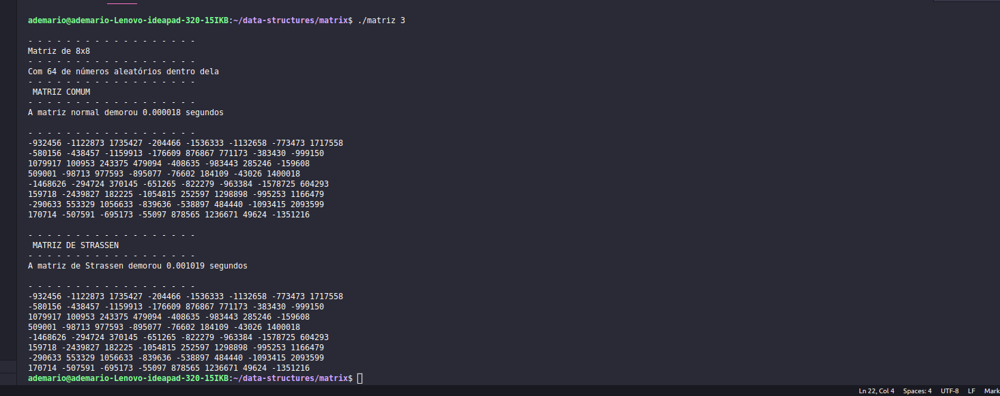

# data-structures
Repositório sobre estrutura de dados

# como iniciar o projeto?

```
$ cd matrix
$ gcc matriz.c -o matriz -lm
$ ./matriz <numero da potencia, a parte de potenciação já é feita dentro do algoritmo>
```
# Caso de teste:

```
$ cd matrix
$ gcc matriz.c -o matriz -lm
$ ./matriz 3
```
# O que o terminal printou?

